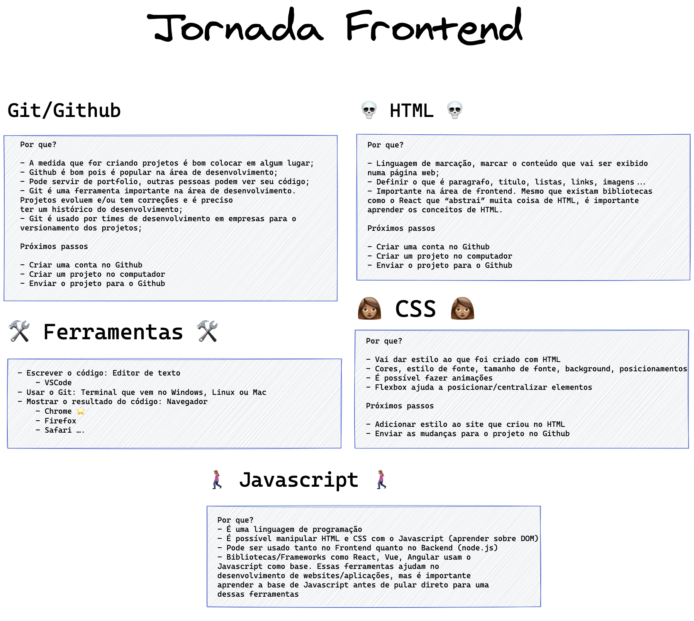

# 🗺 Jornada Frontend

## :octocat: Git/Github

### Por que?

- A medida que for criando projetos é bom colocar em algum lugar;
- Github é popular na área de desenvolvimento;
- Pode servir de portfolio, outras pessoas podem ver seu código;
- Git é uma ferramenta importante na área de desenvolvimento. Projetos evoluem e/ou tem correções e é preciso ter um histórico do desenvolvimento;
- Git é usado por times de desenvolvimento em empresas para o versionamento dos projetos;

### Onde?

- [Curso Udemy: Git e Github para iniciantes](https://www.udemy.com/course/git-e-github-para-iniciantes/)

### Próximos passos

- Criar uma conta no Github
- Criar um projeto no computador
- Enviar o projeto para o Github

## Ferramentas

- Escrever o código: Editor de texto
  - VSCode
- Usar o Git: Terminal que vem no Windows, Linux ou Mac
- Mostrar o resultado do código: Navegador
  - Chrome ⭐️
  - Firefox
  - Safari
....

## 💀 HTML

### Por que?

- Linguagem de marcação, marcar o conteúdo que vai ser exibido numa página web;
- Definir o que é paragrafo, titulo, listas, links, imagens...
- Importante na área de frontend. Mesmo que existam bibliotecas como o React que "abstrai" muita coisa de HTML, é importante aprender os conceitos de HTML.

### Onde?

- [HTML Básico](https://developer.mozilla.org/pt-BR/docs/Aprender/Getting_started_with_the_web/HTML_basico)
- [HTML básico - códigos HTML](https://www.devmedia.com.br/html-basico-codigos-html/16596)
- [HTML Semântico](https://www.devmedia.com.br/exemplo/html-semantico/6)
- Video
  - [Curso de HTML5 - Site Completo - by Gustavo Guanabara](https://www.youtube.com/watch?v=epDCjksKMok&list=PLHz_AreHm4dlAnJ_jJtV29RFxnPHDuk9o)
    - Esse curso é antigo, porém o HTML, CSS, JS se mantem o mesmo com algumas novidades. É legal de começar por ele e depois aprender outras coisas como por exemplo Flexbox no CSS.
  - [Curso de HTML - Introdução e Primeiros Passos - #01](https://www.youtube.com/watch?v=F2FuWBbrkDU&list=PL4iwH9RF8xHnU9L-1AQPOx6rtLXjoQzTV&index=1)
 

### Próximos passos

- Criar um site pessoal como se fosse seu curriculum
- Não precisa do estilo ainda, cria somente a estrutura e as informações
- Enviar o código para o Github

## 👩🏽 CSS

### Por que?

- Vai dar estilo ao que foi criado com HTML
- Cores, estilo de fonte, tamanho de fonte, background, posicionamentos
- É possível fazer animações
- Flexbox ajuda a posicionar/centralizar elementos

### Onde?

- [Iniciando com o CSS](https://developer.mozilla.org/pt-BR/docs/Web/CSS/Getting_Started)
- [[Inglês] A Complete Guide to Flexbox](https://css-tricks.com/snippets/css/a-guide-to-flexbox/)

### Próximos passos
- Adicionar estilo ao site que criou no HTML
- Enviar as mudanças para o projeto no Github

## 🚶🏽‍♀️ Javascript

### Por que?

- É uma linguagem de programação
- É possível manipular HTML e CSS com o Javascript (aprender sobre DOM)
- Pode ser usado tanto no Frontend quanto no Backend (node.js)
- Bibliotecas/Frameworks como React, Vue, Angular usam o Javascript como base. Essas ferramentas ajudam no desenvolvimento de websites/aplicações, mas é importante aprender a base de Javascript antes de pular direto para uma dessas ferramentas

### Onde?

- [O que é Javascript? - Primeiros passos](https://developer.mozilla.org/pt-BR/docs/Learn/JavaScript/First_steps/O_que_e_JavaScript)
- Livros:
  - [JavaScript Eloquente - 2a edição](https://github.com/braziljs/eloquente-javascript)
  - [You Don't Know JS (série de livros)](https://github.com/cezaraugusto/You-Dont-Know-JS)

### Próximos passos

- Criar um site pessoal como se fosse seu curriculum
- Não precisa do estilo ainda, cria somente a estrutura e as informações
- Enviar o código para o Github

## ☀️ Mais

- Aprender como fazer um projeto que está no Github aparecer em uma página usando o Github Pages
    - Criar um site do [GitHub Pages](https://docs.github.com/pt/github/working-with-github-pages/creating-a-github-pages-site)
- Ideias de projetos para treinar:[https://github.com/estevanmaito/apenas-crie-websites](https://github.com/estevanmaito/apenas-crie-websites)
- [Site com tutoriais HTML, CSS, JS - Tem básico, intermediário e avançado](http://www.htmldog.com/guides/)
- [Criar um site simples usando HTML, CSS e JavaScript](https://docs.microsoft.com/pt-br/learn/modules/build-simple-website/)